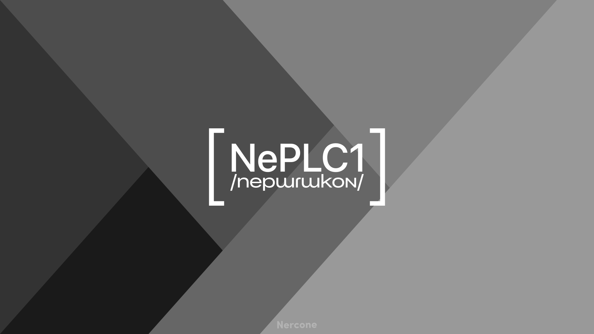

# NePLCone /nepɯɾɯkoɴ/
Nercone Programming Language with C compiler 1

## NePLConeとは
NePLCone(Nercone Programming Language with C compiler 1)はC言語の勉強と共に開発を開始した新しいプログラミング言語とそのコンパイラーです。
実際には、NePL(Nercone Programming Language)を定義し、その言語のコードをC言語に変換してから、そのC言語のコードを外部のコンパイラにコンパイルさせる(with C compiler)というものです。
私は過去に[YPSH](https://github.com/YPSH-DGC/YPSH/)という多機能なプログラミング言語を作りましたが、とても実用的ではない速度で、かといってコンパイラを作るのは難しく、ならFlutterのDartのように「別の言語に変換」すれば良いのではと考え、開発を開始しました。
コンパイラ型の言語は初めて作るため、最初に作ったコンパイラ型言語なので「1」を追加しました[^1]。なお表記時は「One」でもOKです。

[^1]: 単純に語呂が良かっただけです...

## NePLConeの表記/発音
**通常(en-US):** Nercone Programming Language with C compiler 1, Nercone Programming Language with C compiler One
**略称(en-US):** NePLCone, NePLC1
**ひらがな(ja-JP):** ねぷるこん
**カタカナ(ja-JP):** ネプルコン
**IPA(おおよその発音):** /nepɯɾɯkoɴ/

## 進捗

### 注意
C言語の勉強と並行なので結構時間かかります...
暖かい目で見ていただければ嬉しいです。

### ロードマップ
- [x] とりあえずREADME作る
- [ ] ソースコードのライセンスを決める
- [ ] Naniを使いつつREADMEの英語版を作る
- [ ] 言語の構文を決める
- [ ] 書き方ごとの動作を決める
- [ ] より細かい仕様を決める
- [ ] C言語側のコンパイラを決める
- [ ] より具体的な構造を決める
- [ ] フォルダ構造だけ作る
- [ ] ファイル構造まで作る

### 現時点での予定
- インデントとか改行とかに縛られないものにする
- 学びやすく使いやすい言語にする

## ライセンス
ソースコードのライセンスは未定ですが、画像などのコンテンツのライセンスは[CC BY 4.0](https://creativecommons.org/licenses/by/4.0/)です。
